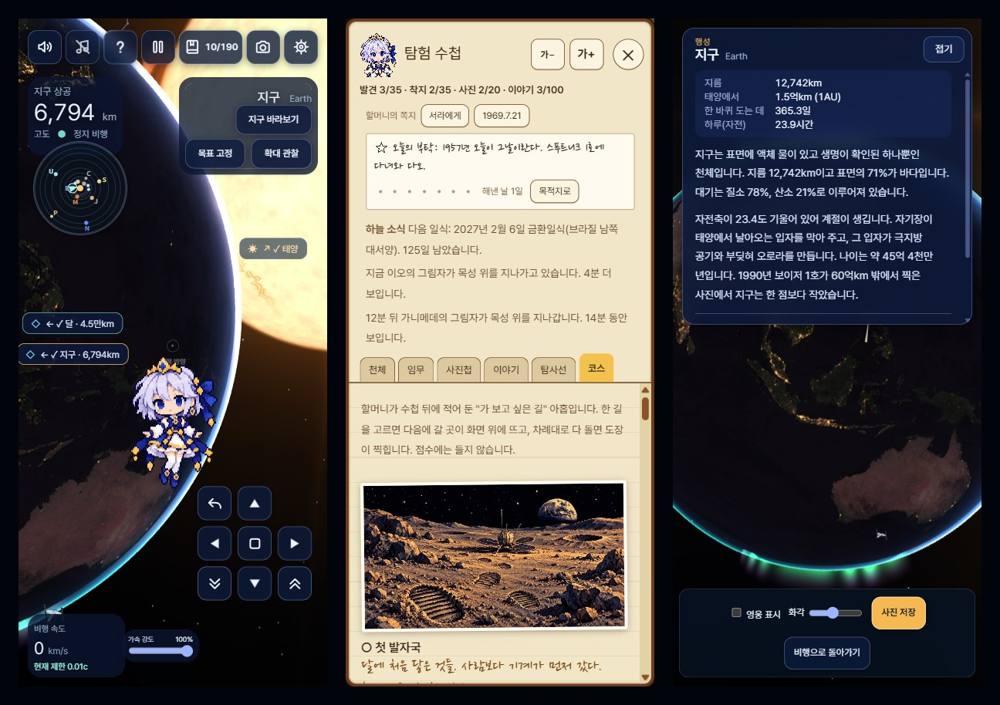

# Space Oddity — 우주 한량

도트 그림 마법사 소녀 서라가 되어 실제 크기의 태양계를 나는 브라우저 게임이다. 설치 없이 주소만 열면 PC와 휴대전화에서 돌아간다.

주소: https://destory1984.github.io/oddity_claude/



## 무엇이 있나

| 종류 | 내용 |
|---|---|
| 천체 35개 | 태양, 행성 8개, 왜행성 2개(세레스, 명왕성), 혜성 3개(핼리, 헤일-밥, 추류모프-게라시멘코 67P), 위성 21개(카론, 달, 포보스, 데이모스, 이오, 유로파, 가니메데, 칼리스토, 미마스, 엔셀라두스, 테티스, 디오네, 레아, 타이탄, 이아페투스, 미란다, 아리엘, 움브리엘, 티타니아, 오베론, 트리톤) |
| 탐사선·망원경·정거장 22개 | 보이저 1·2호, 허블, 제임스 웹, 케플러, 찬드라, 유클리드, 국제우주정거장, 톈궁, 스푸트니크 1호, 화성 정찰 궤도선, 주노, 카시니, 파커 태양 탐사선, 테슬라 로드스터, 뉴허라이즌스, 파이어니어 10·11호, 다누리, 달 정찰 궤도선, 유로파 클리퍼, 루시. 도킹하면 발사 연도와 소개가 옆에 뜬다 |
| 하늘 | 은하수, 가까운 은하 4개(안드로메다, 삼각형자리, 대마젤란, 소마젤란), 성운과 성단 5개(오리온 대성운, 용골자리 성운, 석호 성운, 플레이아데스성단, 오메가 센타우리), 황도광, 별자리 20개(오리온, 큰곰, 작은곰, 카시오페이아, 남십자, 전갈, 고니, 사자, 황소, 쌍둥이, 큰개, 거문고, 독수리, 궁수, 안드로메다, 페가수스, 페르세우스, 처녀, 센타우루스, 목동), 유명한 별 11개 |
| 소행성대 | 화성과 목성 사이의 풍경. 멀리서는 흐린 점 띠, 안에 서면 둘레에 바위가 보인다. 기록 대상이 아니고 부딪히지 않는다 |
| 할 일 | 발견 35, 착지 35, 사진 임무 19, 이야기 장소 94. 모두 183칸 |
| 도킹 | 탐사선이나 망원경 1만km 안에서 이름표나 도킹 버튼을 누르면 영어 음성이 "Docking in progress"에 이어 3부터 0까지 세는 동안(모두 6.1초) 부드럽게 다가가 0에 붙고, 함께 움직인다. 다가가는 동안 시선이 0.42라디안(24도) 옆으로 돌아가, 붙었을 때 탐사선이 캐릭터 뒤에 가려지지 않고 옆에 선다(세로 화면에서는 위에 온다). 전진·후진을 누르면 떨어지고, 그 탐사선의 속도를 이어받아 계속 난다. 지표면 200km 안을 나는 다누리와 달 정찰 궤도선에는 땅 반대쪽, 곧 바로 위 60km에 붙는다(옆이나 아래에 붙으면 땅에 스치거나 묻힌다). 다가가는 길도 땅 위 20km 아래로는 내려가지 않는다 |
| 순간 이동 | 한 번 가 본 곳은 멀리서 이름표를 누르거나 수첩의 "순간 이동"을 누르면 6초짜리 번쩍이는 효과와 함께 그곳에 나타난다. 수첩에는 만난 탐사선 목록이 따로 있다(점수에는 들지 않는다). 천체는 반지름 5배 거리의 햇빛 든 쪽에서 바라보고, 탐사선은 300km 곁에 나타나 도킹하고, 이야기 장소는 400km 위에 나타난다. 도착하면 그 대상의 설명이 알림에 함께 뜬다(도킹하는 탐사선은 소개 카드가 대신한다) |
| 곁으로 내려가기 | 달·화성·타이탄의 착륙선과 탐사차, 달과 화성의 명소, 독도는 금빛 ✦ 이름표가 보일 때 누르면 "Landing in progress"라는 말 뒤에 3부터 0까지 세는 5.6초 동안 미끄러져 내려가 25km 곁, 땅 위 1.5km에 선다. 모형이 캐릭터 옆에 보이도록 그쪽을 향한다. 땅이 자전하므로(화성 적도는 게임에서 1초에 177km) 그 자리에 붙들려 함께 돌고, 전진이나 후진을 누르면 떠난다. 처음 간 곳이면 이야기와 착지가 기록된다 |
| 오로라·번개·분출 | 지구(위도 67도)와 목성(76도)의 두 극 둘레에 오로라 띠가 밤 쪽에서 일렁인다. 목성의 밤 쪽 구름에는 0.3 → 1.6초마다 번개가 친다. 달의 밤 쪽에는 2 → 6초마다 충돌 섬광이 번쩍인다(달은 공기가 없어 별똥별이 타지 않고 그대로 땅에 부딪힌다. 실제 섬광은 0.1초쯤이고 훨씬 드물다). 이오에는 화산 분출 셋(펠레 350km, 로키 200km, 프로메테우스 100km 높이), 엔셀라두스 남극에는 얼음 분출 다섯 줄기(450km)가 솟는다. 가까이 가면 처음 한 번씩 설명이 뜬다. 오로라의 높이(지구 700km, 목성 4,000km)와 밝기, 번개 크기(1,500 → 4,000km)는 궤도에서 보이도록 키운 값이고, 이오 화산의 좌표는 아직 출처와 대조하지 않았다 |
| 그 밖의 장관 | **태양**: 가장자리에 붉은 홍염 일곱이 솟는다. 코로나는 굵은 줄기가 천천히 자리를 옮기고 가는 결이 바깥으로 흘러 나간다. 달이나 행성이 태양을 다 가리면 진줏빛 코로나가 두 갈래로 퍼지고, 태양이 6% 아래로 남는 순간에는 가장자리에 빛 한 점이 번쩍인다(다이아몬드 반지). **혜성**: 곧은 푸른 가스 꼬리 옆에, 궤도 뒤쪽으로 21도쯤 처진 누런 먼지 꼬리가 하나 더 있다. **역광의 대기 고리**: 해를 등지게 뒤로 돌아가 보면 명왕성은 푸른, 타이탄은 주황, 화성은 푸른, 금성은 누런 고리로 가장자리가 빛난다. **토성**: 북극에 육각형 구름(극에서 12도). **타이탄**: 북극 호수에 비친 햇빛의 반짝임. **지구**: 밤 쪽 구름 속 번개(0.5 → 2.2초마다)와 가장자리의 가는 초록 대기광. **화성**: 낮 쪽 땅의 먼지 회오리 여섯(높이 45km로 키워 그림). **하늘**: 오리온 대성운, 용골자리 성운, 석호 성운, 플레이아데스성단, 오메가 센타우리(실제 크기의 3배), 그리고 행성들의 평면을 따라 태양 쪽으로 밝아지는 황도광 |
| 수첩 | 천체, 사진 임무, 사진첩, 이야기 장소, 탐사선, 코스의 여섯 갈래로 나뉘어 한 번에 한 갈래만 보인다. 제목과 닫기(✕) 단추는 늘 위에 있고, Esc나 J 키, 수첩 바깥을 눌러도 닫힌다. 폭 480px 아래의 휴대전화에서는 화면을 가득 채운다. 갈래를 나누기 전에는 375px 화면에서 길이가 11,400px였고 닫기 단추가 맨 아래에 있었다 |
| 사진첩 | 사진 모드에서 저장한 사진의 작은 사본(가로 480px)이 수첩에 최근 24장까지 모인다. 찍은 날짜와 자리, 그 사진으로 달성한 임무와 그 임무가 따라 한 실제 사진의 설명이 함께 붙는다. 브라우저에만 저장된다 |
| 할머니의 쪽지 | 이야기 「할머니의 수첩」의 첫 부분이다. 이웃집 할머니가 적다 만 수첩을 서라가 대신 채운다는 줄거리이고, 할머니는 손글씨 쪽지로만 나온다. 쪽지는 5장이다: 처음 열 때(시작 2초 뒤), 달에 처음 내려앉을 때(1969.7.21), 40칸(1979), 100칸(1986), 183칸을 모두 채울 때(마지막 장). 쪽지가 열린 동안 게임은 멈추고, 접으면 서라가 머리 위 말풍선으로 한마디 한다(5초). 읽은 쪽지는 수첩 위쪽 "할머니의 쪽지" 줄에서 다시 읽는다. 이야기가 들어오기 전의 기록으로 열면 밀린 쪽지가 오래된 것부터 20초 넘게 사이를 두고 한 장씩 나온다. 쪽지 글은 처음 잡아 본 것이다 |
| 할머니의 메모 | 수첩의 천체 35칸마다 할머니가 지구에서 보거나 읽은 것을 적은 메모 한 줄이 처음부터 붙어 있다(예: 목성 "1994.7. 슈메이커-레비 혜성이 목성에 부딪힘. 망원경으로 검은 멍을 봤다."). 그 천체를 발견하면 서라가 말풍선으로 한마디 하고("멍은 없어! 대신 붉은 점이 엄청 커."), 그 말이 메모 아래에 남는다. 메모의 날짜와 발견자는 기억으로 쓴 것이라 출처와 대조하지 않았다 |
| 마지막 칸 | "창백한 푸른 점"은 사진 임무와 이야기 장소에 한 칸씩, 두 칸이다. 나머지 181칸을 채우기 전에는 닫혀 있고 수첩에는 할머니의 신문 스크랩 한 줄만 보인다. 181칸을 채운 뒤 지구에서 6,000만km(실제 거리로 60억km) 넘게 떨어져 지구를 점으로 찍으면 사진 한 장으로 두 칸이 함께 채워진다. 그러면 수첩 마지막 장(할머니가 다 채운 사람에게 남긴 글)이 열리고, 할머니 댁 대문 앞에서 "할머니, 나 왔어!" 한마디로 끝난다(글만 나오고 그림은 없다). 이야기가 들어오기 전에 이 칸을 채운 기록은 그대로 둔다 |
| 엽서와 답장 | 수첩의 사진첩에서 사진 아래 "할머니께 엽서로"를 누르면 그 사진을 엽서로 보낸다(사진 한 장에 한 번). 다음 날 이후 게임을 열면 2초 뒤 할머니의 답장이 종이 한 장에 모여 뜨고, 사진첩의 그 사진 아래에도 남는다. 며칠을 걸러도 답장은 기다린다. 답장에는 별 0 → 3개가 붙는다. 찍는 순간의 구도 네 가지(주인공 천체가 화면 높이의 25 → 70%, 중심이 가운데 1/3 밖, 밝은 쪽이 40% 넘게 보이거나 10% 아래의 역광, 다른 천체나 캐릭터가 함께 있음) 가운데 둘을 채우면 별 하나, 셋이면 둘, 넷이면 셋이다. 답장 글은 찍힌 천체에 따라 15가지, 임무에 따라 3가지, 그 밖 4가지이고 처음 잡아 본 것이다. 사진첩이 24장으로 차도 답장을 기다리는 엽서는 다른 사진보다 나중에 밀려난다 |
| 혼자 남은 탐사선 | 오퍼튜니티, 스피릿, 루노호트 1호, 피닉스 곁에 내려서 이야기 카드를 닫거나, 보이저 1호, 보이저 2호, 다누리에 도킹하면 서라가 말풍선으로 안부를 한마디 건넨다(예: "여기서 14년 넘게 일했대. 수고했어."). 게임을 한 번 여는 동안 한 곳에 한 번이다. 곁에 앉는 그림은 아직 없다 |
| 여행 코스 아홉 | 수첩의 "코스" 갈래에 할머니가 적어 둔 "가 보고 싶은 길" 아홉이 있다: 첫 발자국(4곳), 아폴로의 여섯 자리(6), 보이저의 그랜드 투어(5), 물을 찾아서(5), 붉은 행성의 차들(6), 화성 관광(5), 한국의 우주(4), 혜성 사냥꾼(3), 와디럼에서 스키아파렐리까지(4). "이 길로 떠나기"를 누르면 다음에 갈 곳이 목적지로 잡히고 화면 위 줄에 "2/6 아폴로의 여섯 자리: 아폴로 12호 착륙지"처럼 뜬다. 그 줄의 "근처로"를 누르면 가 본 적이 없어도 그 가까이로 순간 이동한다(표면의 장소는 400km 위라서 내려가기는 손으로 한다). 차례대로 닿을 때마다 서라가 한마디 하고(42곳에 한 줄씩), 다 돌면 코스 이름 옆에 "도장"이 붙는다. 점수에는 들지 않고, 도중에 꺼도 이어진다. 아홉째 코스는 2015년의 화성 영화가 지나간 실제 장소만 쓰고 영화 제목과 인물은 적지 않는다. 도장 그림과 종이학 그림은 아직 없어 글자로만 나온다 |
| 소리 | 효과음과 배경 음악. 날 때는 조용한 바람 소리만 난다. 모두 브라우저에서 합성하며 소리 파일은 없다. 음악은 여섯 곡(오르골, 새벽, 먼 바다, 자장가, 별무리, 깊은 밤)이 16마디(약 2분)씩 차례로 흐른다. 8초 한 마디마다 화음 넷이 돌고, 천체 가까이에서는 음이 잦고 먼 우주에서는 낮고 드물다. 효과음은 🔊 버튼, 배경 음악은 ♪ 버튼으로 따로 켜고 끄며, 도움말에서 다음 곡으로 넘길 수 있다 |

## 할 일

- **첫 안내**: 처음 오면 화면 위에 목표 한 줄이 뜬다. 둘러보기 → 달 바라보기 → 달로 날기 → 착지 → 지구돋이 사진, 다섯 걸음이다. "건너뛰기"로 끌 수 있다.
- **발견**: 천체 표면 50,000km 안에 처음 들어가면 수첩에 기록되고, 그 천체의 사실 한 문장이 뜬다. (예: 화성 — "올림푸스 화산은 높이 약 22km로 에베레스트의 2.5배입니다.")
- **착지**: 천체 표면에 처음 닿으면 기록된다. 안으로는 들어갈 수 없다.
- **사진 임무 19개**: 사진 모드에서 "사진 저장"을 누르는 순간의 구도로 판정한다. 여러 개가 유명한 우주 사진을 따라 찍는 것이다.

| 임무 | 조건 |
|---|---|
| 창백한 푸른 점 | 지구가 화면 안에 있고 겉보기 지름이 0.1도 미만 (보이저 1호, 1990년) |
| 지구돋이 | 달 표면 5,000km 안에서 달과 지구를 한 화면에 (아폴로 8호, 1968년) |
| 개기일식 | 다른 천체가 태양 원반 넓이의 90% 넘게 가린 순간, 태양 쪽으로 |
| 고리의 제왕 | 토성이 화면 높이의 40% 이상 |
| 대적점 | 목성이 화면 높이의 90% 이상 |
| 태양 스치기 | 태양 표면 50,000km 안에서 |
| 영웅 셀카 | 영웅을 보이게 두고 행성이나 위성이 화면 높이의 30% 이상 |
| 두 행성 한 컷 | 행성 둘이 한 화면에, 둘 다 화면 높이의 0.5% 이상 |
| 태양계 가족사진 | 해왕성 궤도보다 먼 곳에서 행성 여섯 개 이상을 한 화면에 (보이저 1호, 1990년) |
| 푸른 구슬 | 태양을 등지고, 환한 지구가 화면 높이의 80% 이상 (아폴로 17호, 1972년) |
| 토성의 그늘에서 | 토성 뒤에서 태양이 90% 넘게 가려진 채, 토성이 화면 높이의 30% 이상 (카시니, 2013년) |
| 갈릴레이의 발견 | 목성과 이오, 유로파, 가니메데, 칼리스토를 한 화면에 (갈릴레이, 1610년) |
| 화성의 두 달 | 화성 표면 20,000km 안에서 포보스와 데이모스를 한 화면에 |
| 지구와 달 | 지구와 달을 한 화면에, 지구의 겉보기 지름이 0.1 → 1.5도 (보이저 1호, 1977년) |
| 허블과 지구 | 허블 우주망원경 3,000km 안에서 허블과 지구를 한 화면에 |
| 골든 레코드 | 보이저 1호나 2호 5,000km 안에서 보이저와 태양을 한 화면에 |
| 은하수 한가운데 | 궁수자리 쪽 은하 중심을 화면 가운데 10도 안에 |
| 명왕성과 카론 | 명왕성 표면 50,000km 안에서 명왕성과 카론을 한 화면에 (뉴허라이즌스, 2015년) |
| 혜성의 꼬리 | 핼리 혜성 5,000km 안에서 혜성과 태양을 한 화면에 (지오토, 1986년) |

- **이야기 장소 94곳**: 실제로 일이 있었던 자리 41곳, 달의 명소 20곳, 화성의 명소 11곳, 독도, 요르단의 와디럼 사막, 그리고 달과 화성 밖의 20곳이다. 밖의 20곳은 이오의 펠레 화산, 엔셀라두스의 호랑이 줄무늬, 목성의 슈메이커-레비 9 충돌 자리, 금성의 베네라 7호와 13호, 수성의 메신저 충돌지, 유로파의 코나마라, 세레스의 오카토르, 타이탄의 크라켄 해, 명왕성의 하트, 카론의 모르도르, 토성 북극의 육각형, 해왕성의 대흑점, 지구의 나로우주센터와 케네디 39A 발사대(표면 15곳), 그리고 보이저 2호의 천왕성과 해왕성 통과, 보이저 2호와 파커 탐사선과 국제우주정거장 곁(5곳)이다. 목성, 토성, 해왕성은 땅이 없어 구름 꼭대기의 한 자리에 닿으면 된다. 달의 명소 가운데 16곳은 지구에서 보이는 앞면에 있다(바다 여섯, 분화구 여섯, 산맥과 계곡과 절벽, 무지개의 만, 라이너 감마). 화성의 명소는 올림푸스산, 마리너 계곡, 타르시스 세 화산, 헬라스 분지, 북극관, 남극관, 코롤료프 분화구, 시도니아의 얼굴, 시르티스 메이저다. "창백한 푸른 점"은 수첩의 마지막 칸이라 멀어지기만 해서는 기록되지 않는다(아래 "마지막 칸"). 찾아가면 그 이야기가 뜨고 수첩에 남는다. 처음 닿으면 1.2초 뒤(내려서는 동작이 끝난 뒤) 팝업이 열려 실제 사진 한 장과 서너 문장의 자세한 설명을 보여 준다(그동안 게임은 멈춘다). 가 본 곳에 다시 내려서거나 수첩에서 "자세히"를 눌러도 열린다. 사진은 90곳에 있고(폭풍의 대양과 아홉째 코스의 세 곳인 와디럼, 아키달리아 평원, 스키아파렐리 분화구에는 없다), NASA 등 저작권이 없는 것 83장과 출처를 밝히면 쓸 수 있는 것 7장(ISRO, ESA 셋, 독도, 한국항공우주연구원의 누리호, 베네라 7호 모형)이다. 자세한 설명의 숫자도 기억으로 쓴 것이라 출처와 대조하지 않았다. 달에는 착륙선·탐사차 22곳(루나 2호, 아폴로 11 → 17호, 루노호트, 창어 3 → 6호, 찬드라얀 3호, 슬림 등), 화성에는 12곳(바이킹 1·2호, 패스파인더, 스피릿, 오퍼튜니티, 큐리오시티, 퍼서비어런스, 주룽 등)이 있다. 표면의 82곳과 독도에는 금빛 ✦ 이름표가 붙고, 그 천체 표면에서 반지름의 4배 안(달 6,950km, 화성 13,560km)에서만 보인다.

| 장소 | 조건 | 이야기 |
|---|---|---|
| 아폴로 11호 착륙지 (1969년) | 달 고요의 바다(북위 0.674도, 동경 23.473도) 150km 안에 착지 | 1969년 7월 20일, 닐 암스트롱과 버즈 올드린이 이곳에 내려 21시간 36분 머물렀습니다. |
| 바이킹 1호 착륙지 (1976년) | 화성 크리세 평원(북위 22.27도, 서경 47.95도) 150km 안에 착지 | 1976년 7월 20일 화성에 내려 처음으로 표면 사진을 보내고, 6년 넘게 일했습니다. |
| 하위헌스 착륙지 (2005년) | 타이탄(남위 10.57도, 서경 192.34도) 150km 안에 착지 | 2005년 1월 14일 타이탄에 내렸습니다. 지구에서 가장 먼 곳에 내린 착륙선입니다. |
| 카시니의 마지막 돌입 (2017년) | 토성 표면(구름 꼭대기)에 닿기 | 13년 동안 토성을 돈 카시니는 2017년 9월 15일 토성 대기로 뛰어들어 타 버렸습니다. |
| 뉴허라이즌스의 최근접 (2015년) | 명왕성 표면 12,500km 안을 지나기 | 2015년 7월 14일, 9년 반을 날아온 뉴허라이즌스가 명왕성을 12,500km 거리로 스쳐 갔습니다. |
| 지오토의 혜성 통과 (1986년) | 핼리 혜성 핵 600km 안을 지나기 | 1986년 3월 14일 지오토가 핼리의 핵을 596km 거리에서 지나며 처음으로 혜성 핵을 찍었습니다. |
| 보이저 1호의 길 (2012년) | 보이저 1호 5,000km 안까지 가기 | 1977년 떠난 보이저 1호는 2012년 8월 태양권을 벗어나 별 사이 공간에 들어섰습니다. |
| 로제타와 필레 (2014년) | 추류모프-게라시멘코 혜성 핵 300km 안을 지나기 | 2014년 11월 12일 로제타의 착륙선 필레가 이 혜성에 내렸습니다. 혜성에 내린 첫 탐사선입니다. |
| 독도 | 지구 동해의 독도(북위 37.24도, 동경 131.87도) 40km 안에 착지 | 대한민국의 가장 동쪽 섬입니다. 울릉도에서 87.4km 떨어져 있고, 동도와 서도와 89개의 바위섬으로 이루어져 있습니다. |

달과 화성의 착륙선·탐사차는 모두 그 자리 150km 안에 착지하면 기록된다. 직접 날아가 내려도 되고, 이름표를 눌러 곁으로 내려가도 된다.

| 천체 | 장소(연도) |
|---|---|
| 달 22곳 | 루나 2호 충돌지(1959), 루나 9호(1966), 서베이어 1호(1966), 서베이어 7호(1968), 아폴로 11·12호(1969), 루나 16호(1970), 루노호트 1호(1970), 아폴로 14·15호(1971), 아폴로 16·17호(1972), 루노호트 2호(1973), 루나 24호(1976), 창어 3호(2013), 창어 4호(2019, 뒷면), 창어 5호(2020), 찬드라얀 3호(2023), 슬림(2024), 오디세우스(2024), 창어 6호(2024, 뒷면), 블루 고스트(2025) |
| 달의 명소 12곳 | 티코 분화구, 코페르니쿠스 분화구, 고요의 바다, 비의 바다, 폭풍의 대양, 남극-에이트켄 분지, 섀클턴 분화구, 아펜니노 산맥, 알프스 계곡, 직선벽, 모스크바의 바다, 치올콥스키 분화구. 분화구와 산은 150km, 바다는 200km, 남극-에이트켄 분지는 300km 안에 착지. 모형은 없다 |
| 화성 12곳 | 마스 3호(1971), 바이킹 1·2호(1976), 패스파인더(1997), 비글 2호(2003), 스피릿(2004), 오퍼튜니티(2004), 피닉스(2008), 큐리오시티(2012), 인사이트(2018), 퍼서비어런스(2021), 주룽(2021) |

독도에는 서도와 동도를 그린 도트 그림 한 장(384×192)이 서 있다. 섬은 폭이 1km 남짓이라 지도에는 한 점으로도 나오지 않아서, 가까이에서는 폭 12km, 멀리서는 60km까지 키워 그리고 늘 보는 쪽을 향하게 했다. 달, 화성, 타이탄의 35곳에는 모형이 서 있다. 6,000km 안에서 보이고, 실제로는 몇 m라 6 → 30km 크기로 키워 그렸다. 모형은 열여덟 가지다. 아폴로 달 착륙선과 깃발, 서베이어, 루나 시료 귀환선, 루노호트, 창어식 착륙선(시료 귀환형은 상승선을 얹음), 코를 박고 선 슬림, 기울어진 오디세우스, 바이킹, 꽃잎을 편 패스파인더와 소저너, 부채꼴 전지판의 피닉스와 인사이트, 스피릿·오퍼튜니티, 주룽, 큐리오시티, 헬리콥터를 곁에 둔 퍼서비어런스, 비글 2호, 하위헌스, 루나 9호식 캡슐, 반쯤 묻힌 루나 2호가 있다. 착륙지 좌표와 이야기 문장의 숫자는 아직 출처와 하나하나 대조하지 않았다.

수첩의 천체 목록은 태양, 그다음 태양에서 가까운 순서(평균 거리)로 행성·왜행성·혜성이 오고, 위성은 주인 천체 바로 아래에 큰 것부터 네 칸 들여 적는다.

142칸을 모두 채우면 끝이다. 기록은 브라우저에 저장되어 다시 열어도 남는다.

## 화면

- 왼쪽 위: 가장 가까운 행성이나 태양까지의 고도(위성은 세지 않는다)와 비행 상태.
- 미니맵: 태양과 행성 8개, 내 위치와 방향. 행성을 누르면 고르고, 동그라미에 마우스를 올리면 이름이 뜬다.
- 이름표: 화면 안의 천체와 탐사선에 붙는다. 이름 앞에 수첩에 있는 것은 ✓, 아직 없는 것은 ○가 붙는다(천체는 발견, 탐사선은 1만km 안까지 간 것, 이야기 장소는 기록한 것). 행성이나 달 둘레를 도는 13개는 그 천체에 가까이 가야 모형과 이름표가 보인다(지구 7개와 테슬라 로드스터, 달의 다누리·달 정찰 궤도선, 화성 정찰 궤도선, 목성의 주노, 토성의 카시니). 기준은 표면에서 반지름의 4배 안이다(달 6,950km, 지구 25,500km). 웹처럼 멀리 도는 것은 그 탐사선까지 거리의 2배 안에서 보인다. 지구와 태양은 화면 밖에 있어도 화살표로 언제나 보인다. 위성 이름표가 행성 이름표와 겹치면 위성 쪽을 숨긴다. 다른 천체 뒤에 가려 보이지 않는 것은 이름표도 띄우지 않는다(고른 목적지는 남긴다). 그 밖에도 이름표끼리 겹치면 가까운 것만 보이고, 먼 것은 화면에서 서로 떨어진 뒤에 나타난다. 이름표는 캐릭터 뒤로 지나간다(캐릭터의 윤곽만큼 이름표 층을 도려낸다). 폭 480px 아래의 휴대전화에서는 글자를 줄인다: 화면 밖 화살표는 고른 목적지, 지구, 태양, 첫 안내의 목표에만 남기고, 별자리 이름과 게임 제목, 광속 비율, 가속 막대의 글자를 뺀다. 알림은 미니맵과 캐릭터 사이의 빈 곳에 뜬다.
- 하늘 이름표: 별자리와 은하가 화면에 들어오면 작은 글씨로 이름이 뜬다.
- 아래: 속도, 그 순간의 제한 속도, 가속 강도, 후진·전진·정지 버튼.

## 규칙

- 천체 크기는 실제 반지름을 쓴다. 지구 6,371km, 목성 69,911km, 태양 696,340km.
- 천체 사이의 빈 거리만 1/100로 줄였다. 지구와 태양 사이 빈 거리는 약 1억 4,889만km → 148만 9,000km, 해왕성까지는 약 4,500만km가 된다.
- 위성과 그 행성 사이의 빈 거리는 1/10로 줄였다. 1/100로 줄이면 달이 지구 표면 3,763km 위에 붙어 보였다. 지금은 약 37,600km 떨어져 있다. 토성의 위성은 고리 바깥 가장자리(136,775km)부터 줄여서 고리 안에 들어가지 않게 했다.
- 모든 천체가 실제 공전 주기로 태양이나 행성 둘레를 돌고 실제 주기로 자전한다. 트리톤, 카론, 핼리 혜성만 거꾸로 돈다. 게임 시간은 실제의 720배라 지구 하루(자전)가 2분, 달의 공전이 약 55분, 이오의 공전이 약 3.5분이다. 천체 표면 50,000km 안에 있으면 캐릭터가 그 천체와 함께 움직인다. 그 밖에서 가만히 있으면 천체가 공전해서 멀어진다(토성은 1초에 약 73km).
- 행성의 기본 배치(여행 배치)는 태양 둘레에 흩어 놓은 고정값이며 오늘 날짜의 실제 위치가 아니다. 별자리와 은하는 실제 하늘 좌표에 있다.
- 도움말에서 "오늘의 하늘"로 바꾸면 행성과 달이 게임을 연 날짜의 실제 방향에 놓인다(JPL 근사 궤도 요소, 오차 1도 미만. 달은 6도까지). 2026년 10월 1일이면 금성이 태양 곁의 초승달로 보인다. 거리는 그대로 1/100이고, 핼리 혜성은 실제대로 30AU 밖에 있어 꼬리가 없다.
- 지구 표면 9,129km 위에서 시작한다.
- 핼리 혜성만 실제 타원 궤도(근일점 0.586AU, 원일점 35.1AU)를 돈다. 실제 핼리는 지금 해왕성 밖에 있어 꼬리가 없으므로, 게임은 근일점 60일 전에서 시작한다. 1시간 놀면 30일이 흘러 꼬리가 약 15만km → 50만km로 길어지는 것을 볼 수 있다. 꼬리는 늘 태양 반대쪽을 향한다.
- 혜성은 셋이다. 헤일-밥(근일점 0.914AU, 주기 약 2,400년, 궤도가 행성들과 거의 수직)은 근일점을 20일 지난 자리에서, 추류모프-게라시멘코(1.243 → 5.68AU, 주기 6.44년)는 근일점 40일 전에서 시작한다. 둘 다 실제로는 지금 그 자리에 있지 않다.
- 지구 표면 3만km 안에 있으면 지구의 밤 쪽에 별똥별이 0.4 → 1.2초마다 하나씩 떨어진다. 90km 높이에서 0.7초 동안 타고, 궤도에서 보이도록 길이를 300 → 700km로 키웠다.
- 소행성대의 바위는 실제보다 훨씬 크고 촘촘하다(지름 60 → 300km, 약 2,000km 간격). 실제 소행성 사이는 평균 100만km쯤이라 그대로 두면 아무것도 보이지 않는다.
- 태양계 밖으로도 계속 날 수 있다. 벽은 없지만 보이저보다 먼 곳에는 찾아갈 것이 없고, 별과 은하는 배경이라 가까워지지 않는다.
- 속도 제한은 가장 가까운 천체 표면까지 거리(km)에 1/초를 곱한 값이다. 최저 0.01c(초속 약 3,000km), 최고 100c. 다가갈수록 저절로 느려지고 멀어질수록 서서히 빨라진다.

| 표면까지 거리 | 제한 속도 |
|---|---:|
| 3,000km 안 | 0.01c |
| 30,000km | 0.1c |
| 300만km | 10c |
| 3,000만km 밖 | 100c |

- 제한이 그대로라면 3초 걸려 제한 속도까지 가속하고, 손을 떼면 그 속도 그대로 계속 난다. 멈추려면 Space나 정지 버튼을 누르고, 반대 방향 키를 누르면 1초 동안 감속한 뒤 반대로 간다.
- 표면 바로 앞까지 갈 수 있지만 천체 안으로는 들어갈 수 없다. 한 프레임에 천체를 통째로 지나칠 속도에서도 표면에서 멈춘다.

## 탐사선, 망원경, 하늘

| 있는 곳 | 이름 | 자리 |
|---|---|---|
| 지구 | 허블 우주망원경 | 표면 540km 위 |
| 지구 | 국제우주정거장, 톈궁, 스푸트니크 1호 | 표면 420km, 390km, 900km 위 |
| 지구 | 찬드라 X선 망원경 | 길쭉한 타원 궤도, 표면 1,600 → 13,300km 위 |
| 지구 | 제임스 웹, 유클리드 | 지구에서 태양 반대쪽으로 15만km(L2 점) |
| 달 | 다누리, 달 정찰 궤도선 | 표면 100km, 120km 위. 도킹하면 바로 위에 붙는다 |
| 화성 | 화성 정찰 궤도선 | 표면 300km 위 |
| 목성 | 주노 | 극을 지나는 타원 궤도, 표면 420km → 80만km 위 |
| 토성 | 카시니 | 고리 바깥, 중심에서 16만km |
| 태양 둘레 | 파커 태양 탐사선 | 태양 표면 6만 2천km → 108만km 위 |
| 태양 둘레 | 케플러 우주망원경 | 지구 궤도에서 지구보다 60도 뒤 |
| 태양 둘레 | 테슬라 로드스터 | 지구 궤도와 화성 궤도 너머 사이, 지구에서 280만 → 490만km |
| 태양 둘레 | 유로파 클리퍼, 루시 | 지구 궤도와 목성 궤도 사이의 긴 타원 |
| 태양계 밖으로 | 보이저 1·2호 | 태양에서 약 2억 5,400만km, 2억 1,200만km(실제 170AU, 142AU를 1/100로 줄임) |
| 태양계 밖으로 | 뉴허라이즌스, 파이어니어 10·11호 | 실제 63AU, 140AU, 114AU |

- 실제로는 몇 m 크기라 보이지 않아서 30km 크기로 키워 그렸다. 모양은 상자, 원통, 공, 회전체를 조합해 만들고 무늬는 작은 캔버스에 직접 그렸다(이미지 파일 없음). 접시 안테나의 급전부와 지지대, 격자 붐, 테두리와 경첩이 있는 태양전지 날개, 냉각 핀 달린 원자력 전지, 자세 제어 분사구까지 실물 자리에 맞춰 넣었다. 국제우주정거장은 격자 트러스와 태양전지 날개 16장, 모듈 10개, 도킹한 우주선 3척, 로봇 팔로 이루어진다.
- 착지하거나 발견으로 기록되지는 않는다. 사진 임무 둘(허블과 지구, 골든 레코드)의 대상이고, 가까이 가면 저절로 느려진다.
- 궤도 시간은 따라잡을 수 있게 늦췄다. 실제 허블은 95분에 한 바퀴인데 게임 시계로는 8초라, 놀이 시간 10분에 한 바퀴로 했다.
- 카시니와 스푸트니크 1호는 이미 타 버렸고 기념으로 둔 것이다. 유로파 클리퍼는 실제로는 2030년 목성에 도착하지만 게임에서는 같은 타원을 계속 돈다.

- 가까이 간 땅: 지도는 가장 좋은 것도 한 픽셀이 2.7km라 가까이 가면 뭉개진다. 그래서 분화구 많은 천체 18개(달, 수성, 화성, 칼리스토 등)는 표면에서 반지름 3배 안으로 들어오면 셰이더가 분화구를 덧그린다. 다가갈수록 60km → 700m 크기까지 다섯 단계로 잔 분화구가 나타나고, 테두리는 햇빛을 받고 바닥에는 그늘이 진다. 실제 지형이 아니라 그럴듯하게 지어낸 것이다.
- 토성 고리는 실제 짜임(C 고리, B 고리, 카시니 간극, A 고리)대로 그렸다. 토성 그림자가 고리에 지고 고리 그림자가 토성에 진다. 고리를 뚫고 지나가면 얼음 알갱이 36 → 90개가 흩날린다.
- 은하수는 궁수자리 쪽이 가장 밝고 가운데를 먼지 띠가 가른다. 가까운 은하는 실제 겉보기 크기의 1.6배로 그렸다.
- 태양이 다른 천체에 일부 가려지면 보이는 부분은 그대로 밝고 둘레의 빛 번짐만 줄어든다. 흑점은 태양 자전(25.4일, 게임 시계로 51분)에 맞춰 움직인다.

## 캐릭터

캐릭터는 두 가지다. 기본은 도트 그림 캐릭터 서라이고, 도움말의 "캐릭터" 단추나 주소 끝의 `?hero=model` 로 종이 인형 3D 모델로 바꾼다. 바꾸면 처음 자리에서 다시 시작한다.

### 도트 그림 (기본)

192×256 크기의 그림 189장을 쓴다. 넉 장짜리 46묶음과 낱장 5장이고, 48색으로 줄여 모두 1.7MB다. 게임은 이 가운데 42묶음을 쓴다(스윙바이 그림 `sling` 은 스윙바이를 없앤 뒤로 나오지 않는다). 2026-10-02에 세 묶음을 더했다: 사진 모드의 V자 포즈(`photo-v2`), 이야기 장소로 내려갈 때 발부터 내려가는 뒷모습(`land-descend`), 땅에 닿아 무릎을 굽혔다 펴는 모습(`land-touch`). 같은 날 소매로 이마의 땀을 닦는 `hot-wipe` 도 받아, 더운 곳에서 부채질(`hot`)과 번갈아 나온다. 카메라를 늘 마주 보는 판 한 장에 그림을 입혀 그린다.

- 날 때: 카메라가 뒤에 있으므로 뒷모습이 보인다. 곧장 날면 곧은 뒷모습, 돌면 기운 뒷모습, 옆걸음이면 옆모습, 후진이면 앞모습이다. 1초에 10장을 넘긴다.
- 멈출 때: 0.8초에 걸쳐 카메라 쪽으로 돌아서고, 다시 날면 돌아서 등진다. 떠 있는 동안은 4초마다 눈을 깜박인다.
- 쉬는 동작: 멈춘 지 3초 뒤 처음, 그 뒤 8 → 15초마다 하나씩 한다. 갸우뚱, 손 흔들기, 빙그르르, 깡충, 두리번, 기지개, 끄덕, 살랑, 만세, 두 손 흔들기, 공중에 앉기, 별 바라보기, 리본 고치기 열세 가지다. 1분 넘게 가만히 두면 꾸벅꾸벅 존다.
- 그 밖의 그림: 도킹하러 다가갈 때 팔 뻗기, 표면에 닿을 때 착지와 서기, 순간 이동(별로 줄어들었다가 다시 나타남), 사진 모드의 브이(V자 손가락), 수첩을 다 채웠을 때 6초 축하.
- 눈부심, 더위, 추위: 태양 표면에서 20만km 안에 멈춰 있으면 눈을 가리고, 그 바깥 0.5AU까지(수성 곁이 든다) 햇빛을 받고 있으면 땀을 흘리며 손부채질을 하거나 소매로 이마를 닦고(번갈아), 행성 그림자 속이나 태양에서 19AU 밖에 멈춰 있으면 떤다. 쉬는 동작 두 번에 한 번꼴로 2초씩 나오고, 멈출 때마다 처음 한 번은 까닭을 알린다. (예: 해왕성 곁 — "춥습니다. 태양에서 30AU 떨어진 이곳의 햇빛은 지구의 900분의 1입니다.")
- 빛: 그린 색 그대로 보인다. 행성 그림자 속에서만 45%까지 어두워진다.
- 마우스 드래그로 돌 때 그림이 깜박이지 않도록, 도는 정도를 약 0.2초에 걸쳐 다듬고 한번 바뀐 그림은 0.3초 동안 유지한다.
- 수첩 제목 옆의 얼굴 그림, 불러오는 화면의 넉 장 움직임, 앱 아이콘도 같은 그림에서 나왔다.
- 화면이 세로로 긴 휴대전화에서는 60% 크기로 줄어든다.

그림은 `public/assets/seora-sprites/` 에 있고, 어떤 그림을 보일지는 `src/core/sprite.js` 가 정하며 `src/render/spriteHero.js` 가 그린다. 그림을 주문할 때 쓴 문서는 `docs/seora-sprite-order.md` 와 `docs/seora-sprite-order-straight-back.md` 다.

### 종이 인형 (`?hero=model`)

얼굴 없는 4등신 종이 인형 마법사 소녀다. 은색 쌍갈래 머리, 가운데 가르마 앞머리, 빨간 귀걸이, 금 테두리 흰 케이프, 줄무늬 셔츠, 발목까지 오는 흰 로브, 갈색 부츠를 하고 있다. 머리와 쌍갈래는 좌우가 같다. 옷에는 손으로 뜬 종이 같은 섬유 결이 옅게 있다.

- 날 때: 몸을 앞으로 뉘고 두 팔을 머리 위로 뻗는다. 쌍갈래는 네 마디로 나뉘어 속도가 빠를수록 빨리 물결치고, 로브는 좁아진다. 좌우로 돌면 몸이 안쪽으로 기운다.
- 멈출 때: 1.5초 뒤 천천히 돌아서 카메라를 본다. 그 뒤 3초가 지나면 첫 동작을 하고, 이후 8 → 15초마다 동작 하나를 한다. 동작은 갸우뚱, 손 흔들기, 빙그르르, 깡충깡충, 두리번, 기지개, 끄덕끄덕, 살랑살랑, 만세, 양손 흔들기 열 가지다.
- 화면이 세로로 긴 휴대전화에서는 60% 크기로 줄어든다.
- 빛: 햇빛은 태양이 실제로 있는 방향에서 오고, 팔이나 머리가 옷 위에 그림자를 드리운다. 행성 그림자 속에 들어가면 햇빛이 꺼지고, 가까운 천체가 되비춘 빛이 그 천체의 색으로 든다(지구 위에서는 푸른빛, 화성 곁에서는 붉은빛). 광선 추적은 아니고 그림자 지도와 조명 셋으로 낸 효과다.

모양은 Blender로 만든 종이 공예 모델에서 가져왔다. 모델을 머리, 몸통, 로브, 팔 위아래, 다리 위아래, 쌍갈래 마디로 잘라 삼각형 680개를 `src/render/mageModel.js` 에 담았고, `src/render/hero.js` 가 이 부품을 관절에 붙여 움직인다. 모델에는 지팡이가 있지만 날 때 팔 동작과 겹쳐서 게임에는 넣지 않았다. 캐릭터 표시는 사진 모드에서 끄고 켤 수 있다.

## 조작

### PC

| 입력 | 동작 |
|---|---|
| 마우스 드래그, 방향키 | 방향 전환 |
| W / S | 전진 / 후진 가속 |
| A / D | 왼쪽 / 오른쪽 옆걸음 |
| Q / E | 좌우로 몸 돌리기 |
| Space | 즉시 정지 |
| P | 사진 모드 |
| J | 탐험 수첩 |
| M | 효과음 켜기 / 끄기 |
| B | 배경 음악 켜기 / 끄기 |
| Esc | 일시 정지, 사진 모드 나가기 |

### 휴대전화

- 왼쪽 스틱: 방향 전환 (누르고 있으면 전진)
- 전진, 후진 버튼: 누르는 동안 가속
- 정지 버튼, 사진 모드 버튼, 수첩 버튼

화면의 이름표를 누르거나 수첩에서 "목적지로"를 누르면 그것을 고른다. 한 번 가 본 곳의 이름표를 멀리서 누르면 그곳으로 순간 이동하고, 탐사선 이름표를 1만km 안에서 누르면 도킹한다. 표면에 있는 장소의 이름표를 누르면 그 곁으로 내려간다. "바라보기"는 비행 방향을 그쪽으로 돌리고, 이미 아는 곳이면 설명을 다시 보여 준다(천체는 사실 한 문장, 탐사선은 소개, 이야기 장소는 그 이야기). "확대 관찰"은 고른 것을 화면 가운데에 두고 가까이에서 본다(천체는 반지름의 4배 거리, 탐사선은 110km, 착륙선은 28km, 명소는 500km). 드래그하면 그 둘레를 360도 돌아가며 본다. 캐릭터는 제자리에 있고 시점만 옮겨 가므로, 이때 찍은 사진은 사진첩에는 들어가지만 사진 임무로는 치지 않는다. 창을 벗어나면 비행이 일시 정지된다.

## 휴대전화에 앱으로 설치

게임 주소를 열고 홈 화면에 추가하면 주소창 없는 전체 화면 앱으로 열린다. 설치할 때 게임 파일(약 20MB)을 모두 받아 두므로, 그 뒤로는 인터넷 없이도 열린다. 새 판을 올리면 다음 실행 때 자동으로 바뀐다.

- 안드로이드 크롬: 메뉴 ⋮ → 앱 설치 (도움말 창의 "지금 설치" 버튼도 된다)
- 아이폰 사파리: 공유 → 홈 화면에 추가

https 주소에서만 설치할 수 있다. 깃허브 페이지 주소는 https다.

## 실행

Node.js 22 이상이 필요하다.

```bash
npm install
npm run dev
```

주소창에 `http://localhost:5173/oddity_claude/` 를 연다. Windows에서 5173번 포트가 막혀 있으면 `npm run dev -- --port 4317` 처럼 다른 포트를 쓴다.

## 시험

```bash
npm test
```

천체 배치와 공전, 제한 속도, 가속과 감속, 표면 충돌, 화면 구도 판정, 미니맵 좌표, 이름표 규칙과 겹침, 사진 임무 19개, 이야기 장소 94곳, 오늘의 하늘, 배경 음악, 수첩 기록과 목록 순서, 장소 곁으로 내려가기, 오로라·번개·분출, 사진첩, 타원 궤도, 혜성 꼬리, 별똥별, 소행성대, 탐사선 자리와 보이는 거리, 도킹, 순간 이동, 하늘 좌표, 태양 가림, 고리 통과, 캐릭터 동작과 조명, 알림 문구, 첫 안내, 사실 문장, 할머니의 쪽지가 나오는 때와 순서를 검사한다. 마지막 칸이 열리는 때, 엽서의 별과 답장이 오는 날도 검사한다. 여행 코스의 차례와 도착 판정도 검사한다. 시험은 385개다.

## 공개

`main` 에 올리면 GitHub Actions가 빌드해서 `https://destory1984.github.io/oddity_claude/` 에 올린다. 저장소가 공개이고 Settings → Pages → Source가 "GitHub Actions"로 되어 있어야 한다.

## 구조

| 폴더 | 내용 |
|---|---|
| `src/core/` | 천체 표, 비행 규칙, 한 프레임 진행. 화면과 무관한 계산이라 전부 시험한다. |
| `src/render/` | Babylon.js로 천체, 태양, 별, 탐사선, 캐릭터를 그린다. 도트 그림 캐릭터는 `spriteHero.js`, 종이 인형은 `hero.js` 와 모양 데이터 `mageModel.js` 다. |
| `public/assets/` | 천체 지도, 캐릭터 도트 그림(`seora-sprites/`), 이야기 장소의 실제 사진(`stories/`, 90장 3.4MB). |
| `src/ui/` | 입력, 화면 표시, 미니맵, 사진 모드, 알림. |

## 출처

지구, 달, 타이탄과 토성·해왕성의 위성은 NASA 지도를, 이오·유로파·가니메데·칼리스토·포보스는 USGS 지도를, 수성·금성·화성·목성·토성·해왕성은 Solar System Scope 지도(CC BY 4.0)를 썼다. 지도 크기는 2048×1024가 기본이고 달, 화성, 목성, 지구 낮 지도는 4096×2048이다. 천왕성과 그 위성 다섯, 데이모스는 셰이더로 그렸다. 탐사선이 찍지 못한 트리톤 북쪽 39%, 명왕성 남쪽 32%, 카론 남쪽 34%는 가장자리의 색을 흐리게 이어 붙여 채웠고 실제 지형이 아니다. 도트 그림 캐릭터 서라는 이 게임에 쓰려고 따로 만든 그림이고, 종이 인형 캐릭터는 Blender로 종이 공예 모델을 만들어 삼각형 680개로 뽑았고, 권리를 보유한다(아래 라이선스 참고). 자세한 출처는 [THIRD-PARTY.md](THIRD-PARTY.md) 에 있다.

## 라이선스

세 부분으로 나뉜다. 정확한 문구는 [LICENSE](LICENSE) 에 있다. MIT 라이선스가 미치는 것은 코드뿐이고, 캐릭터 그림과 외부 사진·지도에는 미치지 않는다.

- **코드**: MIT 라이선스. 저작권 표시만 남기면 누구나 쓰고, 고치고, 팔 수 있다.
- **권리 보유 (MIT에서 제외)**: 도트 그림 캐릭터 서라와 그 그림 파일 189장(`public/assets/seora-sprites/`), 종이 인형 캐릭터(얼굴 없는 종이 인형 마법사, 은색 쌍갈래 머리, 금 테두리 흰 케이프와 흰 로브)와 이를 그리는 `src/render/hero.js`, `src/render/mageModel.js`, 독도 그림(`public/assets/dokdo.png`), 앱 아이콘(`public/icons/`), 게임 이름 "우주 한량"과 "Space Oddity — 우주 한량". 허락 없이 복사하거나 자기 작품에 쓸 수 없다. 이 코드를 가져다 쓰는 사람은 캐릭터, 아이콘, 이름을 자기 것으로 바꿔야 한다.
- **외부 자료 (MIT에서 제외)**: 각자의 조건을 따른다. [THIRD-PARTY.md](THIRD-PARTY.md) 에 파일마다 출처와 라이선스를 적었다.
  - 천체 지도: NASA·USGS 지도는 저작권이 없고, Solar System Scope 지도는 CC BY 4.0이다.
  - 이야기 장소의 사진 90장(`public/assets/stories/`): 83장은 NASA 등 저작권이 없는 사진이다. 나머지 일곱은 출처를 밝혀야 쓸 수 있다. 누리호 사진은 한국항공우주연구원의 공공누리 제1유형, 베네라 7호 모형 사진은 CC BY-SA 4.0이다. 찬드라얀 3호는 ISRO의 GODL-India, 핼리 혜성과 67P 혜성과 코롤료프 분화구는 ESA의 CC BY-SA 3.0 IGO, 독도는 CC BY-SA 3.0이다. CC BY-SA 사진을 고쳐 쓰면 같은 조건으로 내야 한다.
  - 별자리 선: d3-celestial(BSD 3-Clause). 엔진: Babylon.js(Apache 2.0).
