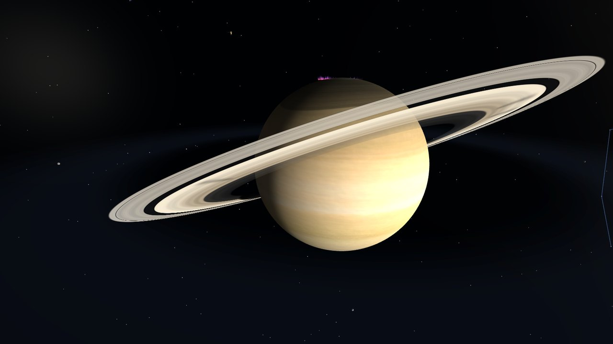
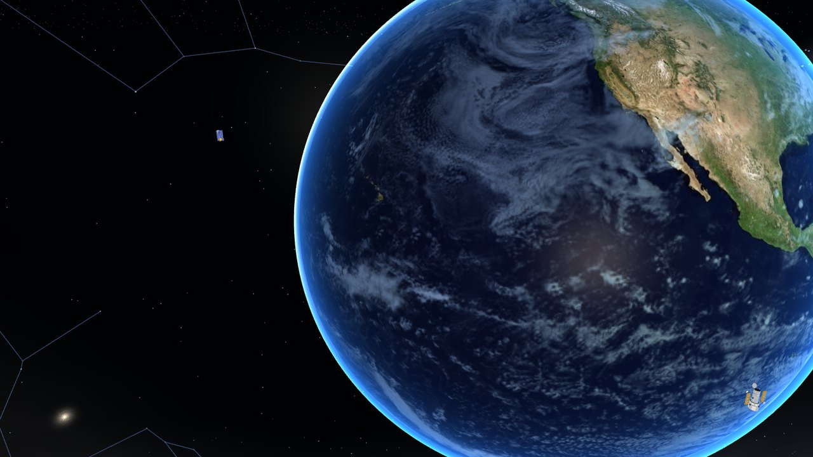
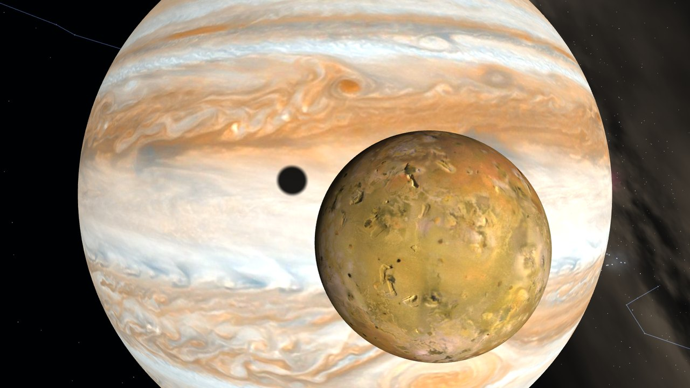
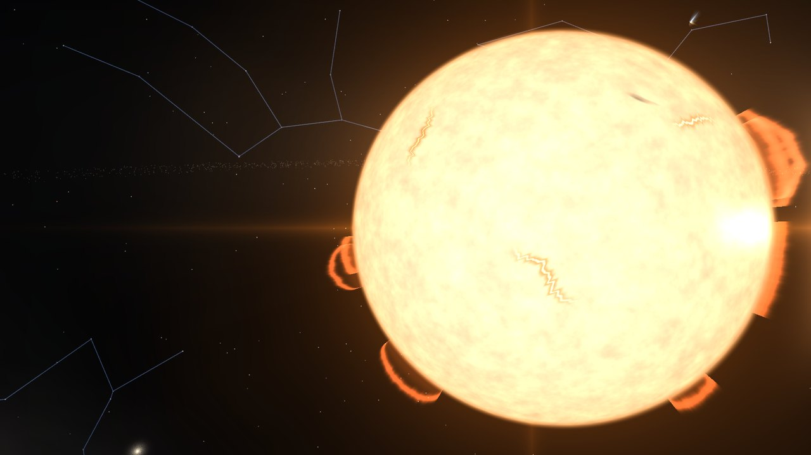
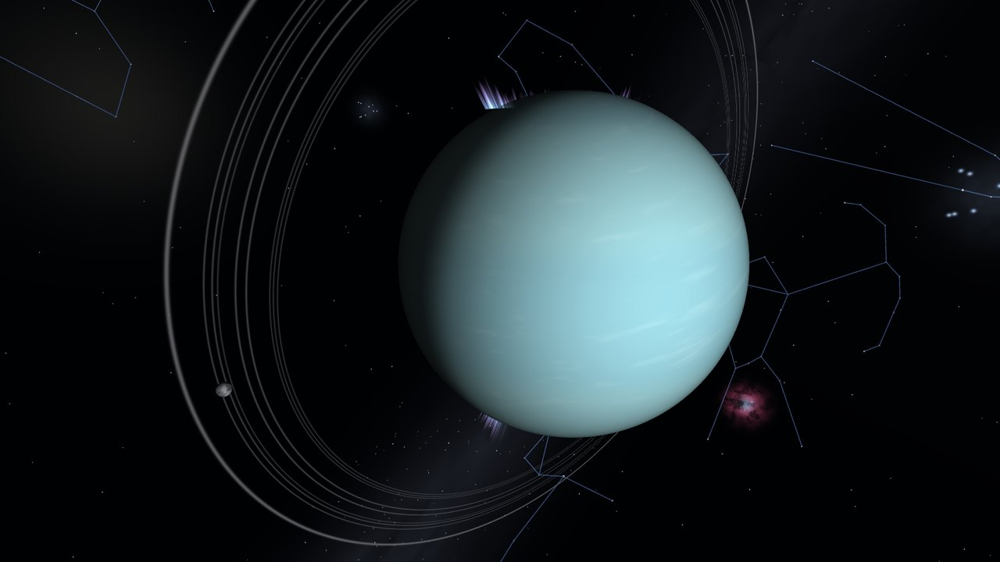

# Space Oddity — 할머니의 수첩

도트 그림 마법사 소녀 소라가 되어 실제 크기의 태양계를 나는 브라우저 게임이다. 설치 없이 주소만 열면 PC와 휴대전화에서 돌아간다.

주소: https://destory1984.github.io/oddity_claude/


게임 안의 사진 모드로 찍은 풍경이다. 소라와 단추만 끄고 그대로 찍었다.

<p>





</p>

만든 이유: 2026.9.30 새벽에 코딩을 하다가 문득 "우주멍"을 때리고 싶었다.

---

이웃집 할머니가 적다 만 탐험 수첩 190칸을 소라가 대신 채우는 이야기다. 할머니는 손글씨 쪽지와 엽서 답장으로만 나온다.

자세한 규칙과 숫자는 모두 [상세기획서](docs/Space-Oddity-상세기획서.md)에 있다. 이 문서는 무엇이 있는지만 짧게 적는다.

## 무엇이 있나

| 종류 | 내용 |
|---|---|
| 천체 35개 | 태양, 행성 8개, 왜행성 2개(세레스, 명왕성), 혜성 3개(핼리, 헤일-밥, 67P), 위성 21개 |
| 탐사선·망원경·정거장 22개 | 보이저 1·2호, 허블, 제임스 웹, 국제우주정거장, 카시니, 다누리 등. 3,000km 안에서 도킹하면 함께 움직이고 소개가 뜬다 |
| 언어 | 한국어, 영어, 일본어, 중국어(간체). 설정에서 고르고, 고르지 않으면 기기 언어를 따른다. 언어마다 문장 약 2,600개 |
| 하늘 | 은하수, 은하 4개, 성운과 성단 11개, 별자리 20개, 유명한 별 11개. 실제 하늘 좌표에 있다. 누르면 설명이 뜬다 |
| 태양계 밖 | 트라피스트-1과 행성 일곱. 케플러 우주망원경에 도킹하면 건너간다 |
| 수첩 190칸 | 발견 35, 착지 35, 사진 임무 20, 이야기 장소 100. 마지막 칸 "창백한 푸른 점"은 나머지 188칸을 채워야 수첩에 나타난다 |
| 이야기 장소 100곳 | 아폴로 11호 착륙지처럼 실제로 일이 있었던 자리와 달·화성의 명소, 독도 등. 95곳에 실제 사진, 3곳에 그림이 붙고, 카드마다 문제가 하나 있다 |
| 사진 임무 20개 | 창백한 푸른 점, 지구돋이처럼 유명한 우주 사진을 따라 찍는다. 여덟은 실제 사진이 내 사진과 나란히 뜬다 |
| 할머니의 쪽지와 엽서 | 쪽지 5장이 수첩을 채우는 동안 열린다. 사진을 엽서로 보내면 다음 날 별 0 → 3개가 붙은 답장이 온다 |
| 오늘의 부탁 | 날마다 하나. 실제 사건이 있었던 35일에는 그 자리에 다녀오는 부탁이다 |
| 여행 코스 아홉 | "아폴로의 여섯 자리"처럼 할머니가 적어 둔 길. 다 돌면 도장이 찍힌다 |
| 그날로 | 여덟 장면을 그 자리에서 22 → 26초 동안 다시 본다: 아폴로 11호, 바이킹 1호, 하위헌스, 큐리오시티의 착륙, 카시니의 마지막 돌입, 그리고 튀면서 내린 루나 9호, 패스파인더, 필레 |
| 실제 일식과 월식 | 2027 → 2030년의 아홉 번. 그날과 앞뒤 사흘 동안 지구의 그 자리에 가서 본다. 거리를 줄인 게임이라 연출이고, 화면에도 그렇게 적혀 있다 |
| 볼거리 서른 가지 남짓 | 오로라, 번개, 이오의 화산, 엔셀라두스의 얼음 분출, 토성 고리의 살 무늬, 위성의 그림자, 태양의 홍염과 코로나 등. 가까이 가면 하루에 한 번씩 알려 준다 |
| 묘기 비행 넷 | 달까지 달리기, 달 스치기, 지구 한 바퀴, 토성 고리 틈 지나기. 점수에 들지 않는다 |
| 소리 | 효과음과 배경 음악 열한 곡. 모두 브라우저에서 합성하며 소리 파일은 없다 |

## 규칙

- 천체 크기는 실제 반지름을 쓴다. 지구 6,371km, 목성 69,911km, 태양 696,340km.
- 천체 사이의 빈 거리만 1/100로 줄였다. 지구와 태양 사이 빈 거리는 약 1억 4,889만km → 148만 9,000km, 해왕성까지는 약 4,500만km가 된다.
  - 이유: 이동이 지루하지 않게 하려는 것이다. 실제 거리 그대로면 가장 빠른 100c(초속 약 3,000만km)로 쉬지 않고 날아도 지구에서 해왕성까지 2분 30초, 보이저 1호까지 14분 동안 빈 우주만 본다. 1/100이면 각각 1.5초와 8.5초 거리다.
- 위성과 그 행성 사이의 빈 거리는 1/10로 줄였다. 달은 지구 표면에서 약 37,600km 떨어져 있다.
  - 이유: 처음에는 위성도 1/100로 줄였는데, 달이 지구 표면 3,763km 위에 붙어 보였고 타이탄이 토성 고리 안에 들어갔다.
- 모든 천체가 실제 주기로 공전하고 자전한다. 게임 시간은 실제의 50배라 지구 하루가 29분, 달의 공전이 약 13시간 7분이다.
  - 이유: 실제 시간 그대로면 한 번 노는 동안 낮과 밤도, 위성도 움직이지 않는다. 처음에는 720배였는데 지구의 땅이 적도에서 1초에 333km씩 움직여 내려서기가 어려웠다. 180배와 100배를 거쳐 50배(1초에 23km)로 낮췄다.
- 속도 제한은 가장 가까운 천체 표면까지 거리(km)에 0.5/초를 곱한 값이다. 최저 0.01c, 최고 100c. 다가갈수록 저절로 느려진다.
- 천체 안으로는 들어갈 수 없고, 부딪혀도 잃는 것이 없다.
- 한 번 가 본 곳은 이름표나 수첩, 큰 지도에서 순간 이동한다(6초).
- 기록은 브라우저에만 저장된다.
- 게임을 열면 방문 한 번이 GoatCounter에 세어진다. 쿠키는 쓰지 않고, 쪽 경로·제목·유입 주소·화면 크기만 보낸다.

## 조작

### PC

| 입력 | 동작 |
|---|---|
| 마우스 드래그 | 방향 전환 |
| W / S | 전진 / 후진 가속 |
| 방향키 | 위, 아래, 왼쪽, 오른쪽으로 옆걸음 (보는 방향은 그대로) |
| A / D | 왼쪽 / 오른쪽 옆걸음 |
| Q / E | 좌우로 몸 돌리기 |
| Space | 즉시 정지 |
| R | 뒤 보기 / 앞 보기 |
| P | 사진 모드 |
| J | 탐험 수첩 |
| M / B | 효과음 / 배경 음악 켜고 끄기 |
| Esc | 일시 정지, 사진 모드 나가기 |

넓은 창에서는 휴대전화를 세워 든 모양의 틀 안에 뜬다. 설정에서 창을 가득 채우는 넓은 화면으로 바꿀 수 있다.

### 휴대전화

- 화면 드래그: 방향 전환
- 오른쪽 아래의 단추 여덟(세 줄): 가운데가 정지, 그 위·아래·왼쪽·오른쪽이 이동 단추로 누르는 동안 그쪽으로 미끄러진다. 맨 위 줄 왼쪽이 후진, 오른쪽이 전진, 맨 아래 줄 왼쪽이 뒤 보기다
- 이름표를 누르면 그것을 고른다. 오른쪽 위 칸의 그림 단추 셋: 눈(바라보기)은 그쪽으로 돌고, 자물쇠(목표 고정)는 화면에 붙잡아 두고, 돋보기(확대 관찰)는 가까이에서 돌려 보며 읽을거리를 띄운다
- 미니맵을 누르면 큰 지도가 열려 갈 곳을 고르고 순간 이동한다
- 위쪽 단추 다섯: 수첩, 사진, 효과음, 배경 음악, 설정(도움말은 설정의 둘째 쪽). 수첩이나 설정을 열거나 다른 앱으로 가면 게임이 저절로 멈춘다

## 휴대전화에 앱으로 설치

게임 주소를 열고 홈 화면에 추가하면 주소창 없는 전체 화면 앱으로 열린다. 설치할 때 게임 파일(약 33MB)을 모두 받아 두므로 그 뒤로는 인터넷 없이도 열린다.

- 안드로이드 크롬: 메뉴 ⋮ → 앱 설치
- 아이폰 사파리: 공유 → 홈 화면에 추가

## 실행과 시험

Node.js 22 이상이 필요하다.

```bash
npm install
npm run dev
```

주소창에 `http://localhost:5173/oddity_claude/` 를 연다. Windows에서 5173번 포트가 막혀 있으면 `npm run dev -- --port 4317` 처럼 다른 포트를 쓴다.

```bash
npm test
```

시험은 582개다. 화면과 무관한 계산(`src/core/`)을 모두 검사한다.

`main` 에 올리면 GitHub Actions가 빌드해서 위 주소에 올린다. 버전은 `package.json` 의 것이고 커밋할 때마다 하나씩 올린다. 설정 창의 제목 옆에 버전과 고친 날짜가 뜬다.

## 구조

| 폴더 | 내용 |
|---|---|
| `src/core/` | 천체 표, 비행 규칙, 한 프레임 진행. 화면과 무관한 계산이라 전부 시험한다 |
| `src/render/` | Babylon.js로 천체, 태양, 별, 탐사선, 캐릭터를 그린다 |
| `src/ui/` | 입력, 화면 표시, 미니맵, 사진 모드, 알림 |
| `public/assets/` | 천체 지도, 캐릭터 도트 그림 229장, 이야기 장소의 실제 사진 95장과 그림 5장, 별자리와 은하 그림 35장, 이야기 그림 46장 |
| `docs/` | 상세기획서, 이야기, 그림 발주서 |

## 출처와 라이선스

정확한 문구는 [LICENSE](LICENSE), 파일마다의 출처는 [THIRD-PARTY.md](THIRD-PARTY.md) 에 있다.

- **코드와 화면 아이콘 18장**: MIT 라이선스.
- **권리 보유 (MIT에서 제외)**: 캐릭터 소라와 그 그림, 이야기 그림, 불러오는 화면 그림, 독도·와디럼·보현산천문대 그림, 이야기 장소의 그림 3장, 따라다니는 것, 앱 아이콘, 제목 글씨, 게임 이름 "Space Oddity — 할머니의 수첩". 허락 없이 복사하거나 자기 작품에 쓸 수 없다. 이 코드를 가져다 쓰는 사람은 이것들을 자기 것으로 바꿔야 한다.
- **외부 자료 (MIT에서 제외)**: 각자의 조건을 따른다.
  - 천체 지도: NASA·USGS 지도는 저작권이 없고, Solar System Scope 지도는 CC BY 4.0이다.
  - 이야기 장소의 사진 95장: 86장은 저작권이 없고, 9장은 출처를 밝혀야 쓴다(CC BY, CC BY-SA, 공공누리 제1유형, GODL-India). CC BY-SA 사진을 고쳐 쓰면 같은 조건으로 내야 한다.
  - 글꼴: Pretendard, 나눔손글씨 펜, 개구. 셋 다 SIL 오픈 폰트 라이선스 1.1이다.
  - 별자리 선: d3-celestial(BSD 3-Clause). 엔진: Babylon.js(Apache 2.0).
